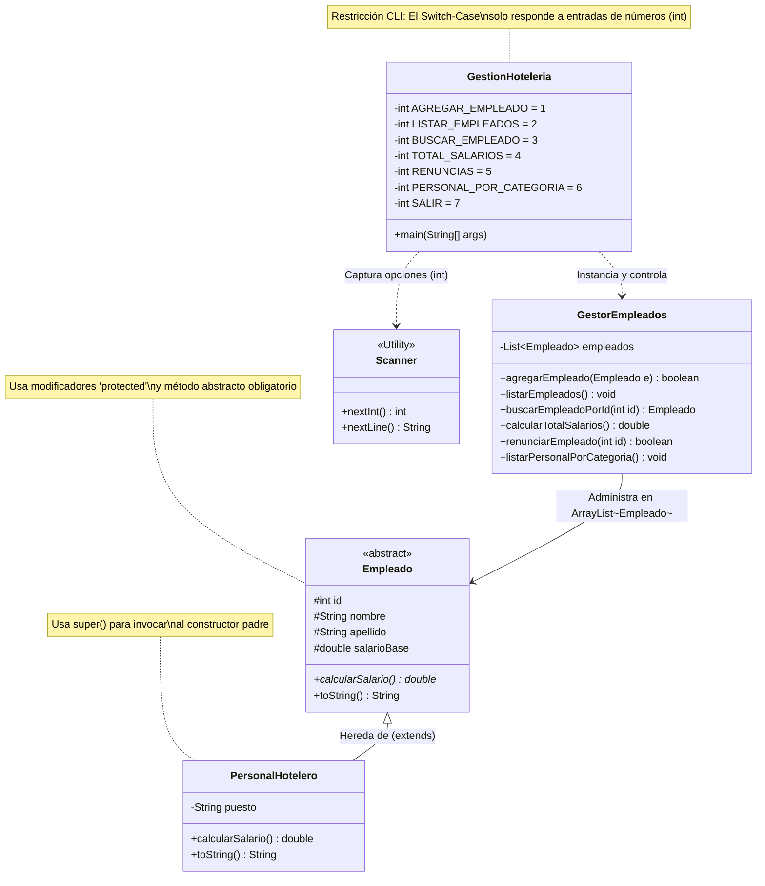

# Desafío Grupal Obligatorio - Sistema de Gestión de Hotelería (CLI) 🏨

Este proyecto consiste en una aplicación interactiva por consola (**Command Line Interface**) desarrollada en Java. Está diseñada para la administración de recursos humanos, control operativo del personal y auditoría presupuestaria en un establecimiento hotelero. El sistema destaca por implementar rigurosamente los pilares de la Programación Orientada a Objetos (POO).

---

## 📊 Diagrama de Arquitectura de Software

A continuación se presenta la estructura de clases, relaciones de herencia y dependencias del sistema. Este diagrama se renderiza automáticamente en GitHub mediante soporte nativo de **Mermaid**:



---

## 📁 Estructura del Proyecto

El repositorio cuenta con los siguientes archivos organizados en la carpeta `DesafioGrupalObligatorio`:

*   **`GestionHoteleria.java`**: Código fuente principal que contiene el punto de entrada (`main`), la lógica interactiva del menú mediante `Scanner` y los modelos estructurales de clases (`Empleado`, `PersonalHotelero` y `GestorEmpleados`).
*   **`AdminHotel.java`**: Archivo complementario destinado a la lógica operativa y de configuración administrativa del hotel.
*   **`Logica utilzada.txt`**: Documento de texto técnico donde el equipo registra criterios de diseño, requerimientos y justificaciones de la arquitectura.

---

## 💻 Arquitectura y Conceptos Avanzados de POO Implementados

La aplicación profundiza en conceptos avanzados del lenguaje Java para garantizar un diseño de software flexible, reutilizable y escalable:

### 1. Clases Abstractas (`abstract`)
*   **`Empleado`** se define como una clase abstracta, lo que significa que **no puede ser instanciada directamente** en el sistema. Funciona como un molde o contrato arquitectónico para la organización.
*   Declara el método abstracto `public abstract double calcularSalario();`. Este método carece de cuerpo de implementación en la clase base, forzando de manera obligatoria a que cualquier subclase concreta (como `PersonalHotelero`) defina su propia lógica de cálculo.

### 2. Modificadores de Acceso Protegidos (`protected`)
*   Los atributos `id`, `nombre`, `apellido` y `salarioBase` de la clase abstracta se declaran como `protected`.
*   Esto garantiza un **acceso protegido**: los miembros son visibles únicamente para la propia clase, clases dentro del mismo paquete y sus subclases directas (herencia). Esto resguarda los datos sensibles frente a accesos externos de otras clases, sin romper el flujo de herencia de datos.

### 3. Invocación de Constructores Padres (`super`)
*   Se utiliza la palabra clave `super()` dentro del constructor de las subclases para invocar directamente al constructor de la superclase.
*   Permite reutilizar la lógica de inicialización de variables de la clase padre (ej. `super(id, nombre, apellido, salarioBase);`), asegurando que los atributos heredados se configuren correctamente en memoria antes de añadir propiedades específicas de la subclase.

### 4. Miembros Estáticos (`static`)
*   Las opciones del menú operativo se definen como variables `private static final int`. La palabra clave `static` indica que estas constantes pertenecen a la clase en sí (`GestionHoteleria`) y no a una instancia particular del objeto, optimizando el uso de memoria RAM.
*   El punto de entrada del programa se declara como `public static void main`, permitiendo que la Máquina Virtual de Java (JVM) ejecute el hilo principal sin necesidad de instanciar previamente la clase contenedora.

---

## 🚀 Interfaz de Consola y Flujo del Menú

Al iniciar la aplicación, el programa ejecuta una **inicialización directa en el método principal**, precargando en memoria una lista inicial con cuatro empleados de prueba utilizando la estructura `GestorEmpleados`:
*   *Marta* (Recepcionista)
*   *Luis* (Chef Ejecutivo)
*   *Sara* (Ama De Llaves)
*   *Carlos* (Gerente)

### Regla Estricta de Entrada del Switch-Case
El menú interactivo se procesa mediante una estructura de control condicional `switch-case` evaluada mediante datos de tipo **entero (`int`)**. 
*   ⚠️ **Restricción de Operación:** El sistema responde **ÚNICAMENTE con números**. Si el usuario ingresa letras o caracteres alfabéticos, la terminal lanzará una excepción debido al tipado estricto de `scanner.nextInt()`. 

```text
--- Sistema de Gestión de Hoteleria ---

 ------Registro------
1. Agregar Personal de Hotel
2. Listado de Empleados
3. Buscar Empleado por ID
4. Presupuesto Total Mensual
5. Renuncias
6. Personal por Categoría
7. Salir

Seleccione una opción: 
```

---

## 🛠️ Características del Gestor de Empleados

La clase encargada de la lógica de negocio (`GestorEmpleados`) procesa la información dinámica mediante las siguientes funciones:
*   **Control de IDs Únicos:** Bucle de validación iterativo que impide registrar un empleado si su ID ya se encuentra guardado en el `ArrayList`.
*   **Auditoría Presupuestaria:** Recorre dinámicamente la lista acumulando los salarios para devolver el presupuesto total mensual necesario.
*   **Clasificación Salarial:** Segmenta automáticamente al personal según sus ingresos en dos rangos definidos por la lógica de negocio:
    *   *Salarios Altos:* Ingresos mayores o iguales a \$1,000,000.
    *   *Salarios Bajos:* Ingresos menores a \$1,000,000.
*   **Gestión de Bajas (Renuncias):** Busca al empleado por su identificador único dentro de la colección y, si existe, remueve el objeto limpiamente liberando los recursos de memoria.

---

## ⚙️ Requisitos y Ejecución Local

Para compilar y ejecutar este programa interactivo por terminal necesitas tener configurado el **Java Development Kit (JDK)** (versión 8 o superior).

1. Clona este repositorio:
   ```bash
   git clone https://github.com
   ```
2. Accede a la carpeta raíz del proyecto fuente:
   ```bash
   cd CLI-DesafioGrupalObligatorio-Cilsa/DesafioGrupalObligatorio
   ```
3. Compila el archivo maestro de Java:
   ```bash
   javac GestionHoteleria.java
   ```
4. Ejecuta el sistema interactivo:
   ```bash
   java GestionHoteleria
   ```

---

## 👥 Colaboradores
Proyecto diseñado, estructurado y documentado en equipo para la entrega académica obligatoria de la comisión de Cilsa.


# SistemaDeBusquedaGUI
Ejemplo: Sistema De Búsqueda de Archivos GUI (App Dev) Java y Framework Java Swing <br/>

Flujo General:<br/>
Se carga la ventana con un formulario y un área de resultados.<br/>
El usuario puede buscar en un archivo CSV seleccionando un criterio y proporcionando un término.<br/>
Los resultados se muestran en pantalla y pueden guardarse en un archivo nuevo.<br/>
El usuario puede cerrar el programa después de calificarlo.<br/>

Este código implementa una aplicación gráfica en Java utilizando Swing.<br/>
La aplicación permite buscar registros en un archivo CSV basado en criterios específicos y realizar operaciones adicionales como guardar los resultados o ajustar encabezados.<br/>
Aquí tienes una explicación detallada paso a paso:<br/>

1. Importación de Bibliotecas.<br/>
javax.swing.* y java.awt.*: Para crear la interfaz gráfica.<br/>
java.io.*: Para manejar operaciones de lectura y escritura de archivos.<br/>
java.text.SimpleDateFormat: Para dar formato a las fechas al guardar archivos.<br/>
java.util.*: Para manejar listas y otros utilitarios.<br/>
javax.swing.event.HyperlinkEvent y java.net.URI: Para manejar enlaces interactivos en la ventana "Acerca de".<br/>

2. Clase Base/Superclase.<br/>
La clase DesafioFinalV2GUI hereda de JFrame, lo que la convierte en una ventana principal de la aplicación.<br/>

3. Atributos de la Clase.<br/>
-Campos de texto (JTextField): Para entrada de datos (nombre del archivo, términos de búsqueda, y encabezados).<br/>
-ComboBox (JComboBox): Permite seleccionar un criterio de búsqueda.<br/>
-Área de texto (JTextArea): Muestra los resultados de las búsquedas.<br/>
-Botones (JButton): Realizan acciones como buscar o limpiar campos.<br/>
-String archivoEntrada: Nombre del archivo por defecto (MOCK_DATA.csv).<br/>

4. Constructor: El constructor inicializa la ventana y configura la interfaz gráfica:<br/>
/Configuración de la ventana/<br/>
Título: "Desafío Final V2 - Sistema de Búsqueda".<br/>
Tamaño: 600x500 píxeles.<br/>
Layout: BorderLayout para organizar componentes en áreas específicas (Norte, Centro, etc.).<br/>

Panel de Entrada: (Norte)<br/>
-Se utiliza un JPanel con GridBagLayout para crear un formulario con campos de entrada:<br/>
-Campo de texto para especificar el archivo CSV.<br/>
-ComboBox para seleccionar criterios de búsqueda: "País", "Ocupación" o "Encabezado Específico".<br/>
-Campos de texto para ingresar encabezados personalizados.<br/>
-Botones Buscar y Guardar y Limpiar.<br/>

Área de Resultados: (Centro)<br/>
-JTextArea muestra los resultados de la búsqueda.<br/>
-Se incluye dentro de un JScrollPane para manejar scroll si hay muchos resultados.<br/>

5. Acciones de los Componentes:<br/>
Botón "Buscar":<br/>
Llama al método realizarBusqueda, que:<br/>
-Verifica si el archivo y el término de búsqueda son válidos.<br/>
-Lee el archivo CSV línea por línea y almacena los registros.<br/>
-Filtra los registros basados en el criterio seleccionado.<br/>
-Muestra los resultados en el área de texto. (JTextArea)<br/>

Botón "Guardar y Limpiar":<br/>
-Llama al método guardarYLimpiar, que:<br/>
-Guarda los resultados en un nuevo archivo CSV.<br/>
-Usa los encabezados personalizados.<br/>
-Limpia los campos de texto.<br/>

Al cerrar la ventana: (X)<br/>
-Sobrescribe el evento de cierre de ventana (windowClosing).<br/>
-Llama a mostrarVentanaValoracion, que:<br/>
-Muestra un cuadro de diálogo con opciones de calificación (1-5 estrellas).<br/>
-Finaliza el programa al cerrar la ventana.<br/>

Barra Menú:<br/>
-Archivo: Permite seleccionar un archivo o salir del programa.<br/>
-Acerca de: Muestra un cuadro con enlaces a los perfiles de los creadores.<br/>

6. Métodos principales con excepciones para crear el menu<br/>

realizarBusqueda:<br/>
-Filtra el contenido del archivo basado en el criterio de búsqueda.<br/>
-Los resultados se almacenan en una lista y se muestran en el área de texto.<br/>

mostrarResultados:<br/>
-Muestra los resultados formateados en el área de texto.<br/>
-Si no hay resultados, muestra un mensaje adecuado.<br/>

guardarYLimpiar:<br/>
-Guarda los resultados en un archivo CSV con un nombre basado en el término de búsqueda o la fecha.<br/>
-Limpia todos los campos y la área de texto.<br/>

limpiarCampos:<br/>
-Restablecer un archivo predeterminado. (archivoField.setText("MOCK_DATA.csv"))<br/>

mostrarVentanaValoracion:<br/>
-Muestra un cuadro de diálogo para calificar el programa antes de salir.<br/>

crearMenu:<br/>
-Configura la barra de menú con opciones de archivo y ayuda.<br/>

seleccionarArchivo:<br/>
-Muestra un cuadro de busqueda de archivos a traves de un explorador. (JFileChooser)<br/>

-mostrarAcercaDe:<br/>
-Muestra un cuadro con enlaces clicables hacia los perfiles de los desarrolladores. (JEditorPane)<br/>

7. Método Main<br/>
Usa SwingUtilities.invokeLater para asegurar que la GUI se ejecute en el hilo adecuado.<br/>
Instancia y muestra la ventana principal.<br/>
